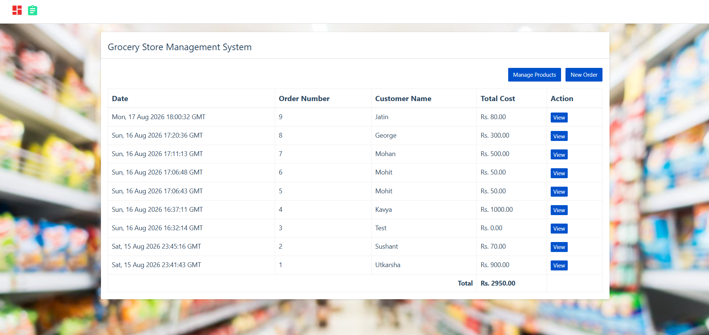
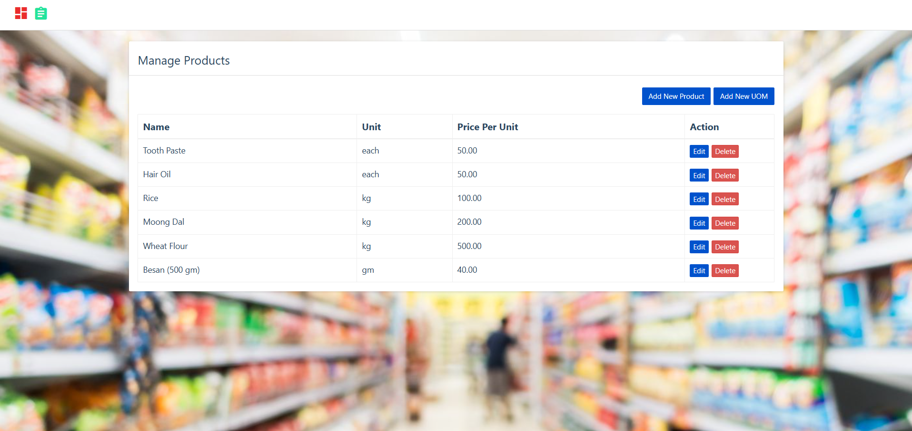
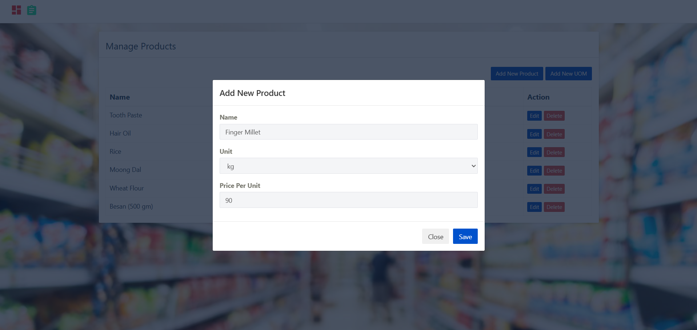
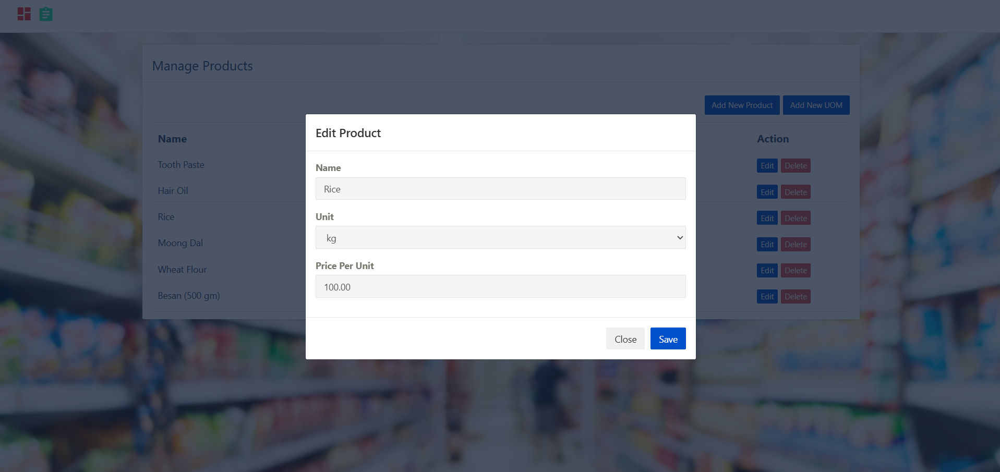
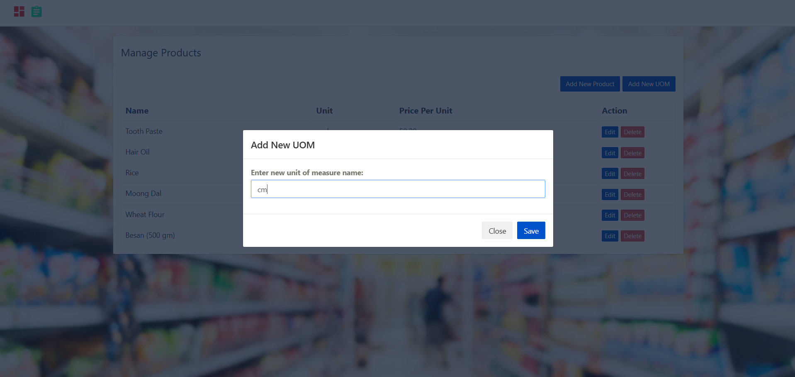
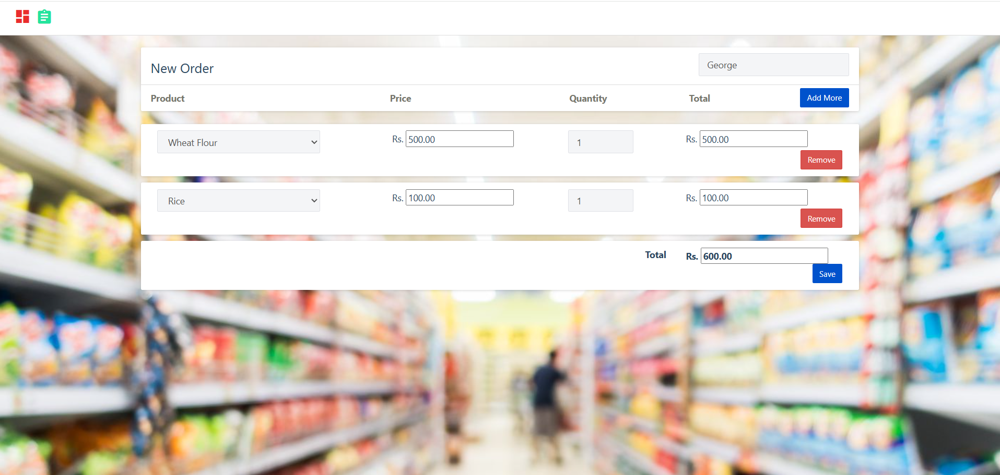
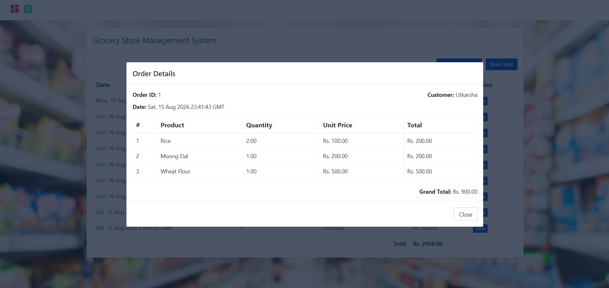

# grocery_webapp_using_python

In this python project, we will build a grocery store management application. It will be 3 tier application,

1. Front end: UI is written in HTML/CSS/Javascript/Bootstrap
2. Backend: Python and Flask
3. Database: Mysql

## Screenshots

### Home Page

### Product management

### Orders

### Installation Instructions

Download mysql for windows: https://dev.mysql.com/downloads/installer/

`pip install mysql-connector-python`
